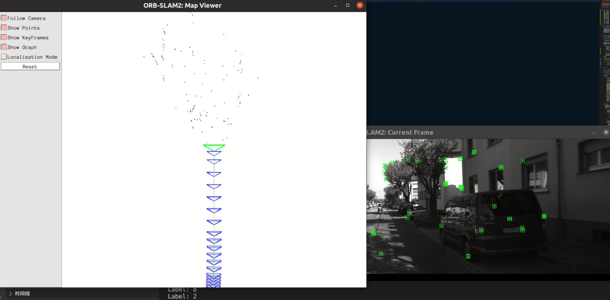

# ORB-SLAM2 with Semantic Segmentation

## 环境准备

参考原项目：<https://github.com/raulmur/ORB_SLAM2#2-prerequisites>

### Pangolin 版本问题

ORB_SLAM2 项目需要使用 Pangolin 0.5 版本，直接从仓库 clone 将得到最新版本，使用时会有冲突。可以通过以下方法下载特定版本：

```bash
git clone --recursive https://github.com/stevenlovegrove/Pangolin.git -b v0.5
```

或者在 release 界面手动下载：<https://github.com/stevenlovegrove/Pangolin/releases/tag/v0.5>

之后正常编译安装即可。

### OpenCV 版本问题

ORB_SLAM2 只在 OpenCV 2.4.11 和 OpenCV 3.2 版本上经过测试。为使用 OpenCV 的新特性，本版本采用了 OpenCV 4.2.0 版本，后续会对相应函数接口进行修改。

## 编译安装

原始版本的 ORB_SLAM2 编译方法如下：

```bash
git clone https://github.com/raulmur/ORB_SLAM2.git ORB_SLAM2
cd ORB_SLAM2
chmod +x build.sh
./build.sh
```

### CMakeLists.txt 的修改

1. 若使用了不同版本的 OpenCV，需要将 CMakeLists.txt 中的 `find_package(OpenCV $OPENCV_VERSION QUIET)` 修改为对应版本。
2. 经测试，使用 `-march=native` 指令优化编译，会导致重复编译后运行时出现错误。目前解决方案是将主目录和 Thirdparty/ 下的 CMakeLists.txt 中的对应指令注释掉。
3. 该版本只对 Monocular 模式进行测试，使用的是 KITTI 数据集，因此可注释掉除了 `Examples/Monocular/mono_kitti.cc` 之外的测试用例的编译。

### Eigen 内存分配器问题

在编译时可能会出现 `static assertion failed` 错误，需要将 `include/LoopClosing.h` 中的

```c++
typedef map<KeyFrame*,g2o::Sim3,std::less<KeyFrame*>,
    Eigen::aligned_allocator<std::pair<const KeyFrame*, g2o::Sim3> > > KeyFrameAndPose;
```

修改为：

```c++
typedef map<KeyFrame*,g2o::Sim3,std::less<KeyFrame*>,
    Eigen::aligned_allocator<std::pair<KeyFrame *const, g2o::Sim3> > > KeyFrameAndPose;
```

### OpenCV 库的引用

OpenCV 的部分函数命名和路径相比旧版本有改动，需要进行以下修改：

1. 在 `include/FrameDrawer.h` 中添加头文件：`#include <opencv2/imgproc/types_c.h>`
2. 将 Examples/ 下需要编译的文件中的 `CV_LOAD_IMAGE_UNCHANGED` 更换成 `cv::IMREAD_UNCHANGED`

### C++ 标准函数库的引用

可能与编译时的 C++ 版本相关，需要在调用了 `usleep()` 函数的文件中添加头文件：`#include <unistd.h>`

## 在建图中加入语义信息

### 语义信息获取

数据文件目录如下：

```bash
dataset
│   times.txt    
│
└───image_02
│   │   000000.png
│   │   000001.png
│   │   ...
│   
└───seg_result
    │   000000.png
    │   000001.png
    │   ...
```

语义分割模型使用 [da-sac](https://github.com/visinf/da-sac)，对 `image_02/` 中的图片进行语义分割处理后，将带 Label 信息的图片存入 `seg_result/` 文件夹中。`times.txt` 文件中的每一行对应图片拍摄时间，单位为秒。

可采用自定义数据集，或者下载 KITTI 数据集，参考：<https://github.com/raulmur/ORB_SLAM2#kitti-dataset>

### 添加语义信息接口

以 Monocular 为例，对代码进行修改，注意保持与头文件的匹配：

1. 将 `src/System.cc` 文件中的

    ```c++
    cv::Mat Tcw = mpTracker->GrabImageMonocular(im,timestamp);
    ```

    修改为：

    ```c++
    cv::Mat Tcw = mpTracker->GrabImageMonocular(im, timestamp, mImseg); 
    ```

    其中 mImseg 为传入的语义信息图片。

2. 修改 `src/Tracking.cc` 中的 `GrabImageMonocular()` 函数定义，形参列表修改为：

    ```c++
    cv::Mat Tracking::GrabImageMonocular(const cv::Mat &im, const double &timestamp, const cv::Mat &imSeg)
    ```

    同时在 `Track()` 函数后添加语义信息处理：

    ```c++
    if (mState == OK)
        UpdateSemantic_cor(mImSeg); 
    ```

    其中，新增的 `UpdateSemantic_cor()` 函数定义如下：

    ```c++
    void Tracking::UpdateSemantic_cor(const cv::Mat &imSeg)
    {
        cv::Mat im;
        im = imSeg;
        const int N=mCurrentFrame.N;
        for(int i=0; i<N; i++)
        {
            MapPoint* pMP = mCurrentFrame.mvpMapPoints[i];
            if(pMP)
            {
                int nKpX = (int)(mCurrentFrame.mvKeysUn[i].pt.x);
                int nKpY = (int)(mCurrentFrame.mvKeysUn[i].pt.y);
                int ucSemanticLabel = int(mImSeg.at<uchar >(nKpY, nKpX));
                pMP->UpdateSemantic(ucSemanticLabel);
            }
        }
    }
    ```

3. 在 `src/MapPoint.cc` 中新增 `UpdateSemantic()` 与 `GetSemanticLabel()` 函数：

    ```c++
    void MapPoint::UpdateSemantic(const unsigned int nSemanticLabel)
    {
        if(nSemanticLabel==0||nSemanticLabel==13||nSemanticLabel==2||nSemanticLabel==3||nSemanticLabel==4||nSemanticLabel==8)
            mvSemanticLabels[nSemanticLabel]++;
        else
            mvSemanticLabels[nSemanticLabel]=0;

        vector<long unsigned int>::iterator vitMaxLabel = max_element(mvSemanticLabels.begin(), mvSemanticLabels.end());
        
        if (*vitMaxLabel == 0)
        {
            mnLabel = -1;
        }
        else if (mnLabel == -1 || *vitMaxLabel > mvSemanticLabels[mnLabel])
        {
            mnLabel = vitMaxLabel - mvSemanticLabels.begin();
            cout << "Label: " << mnLabel << endl;
        }
    }

    int MapPoint::GetSemanticLabel()
    {
        return mnLabel;
    }
    ```

4. 在 `src/MapDrawer.cc` 中，修改 `DrawMapPoints()` 函数为：

    ```c++
    void MapDrawer::DrawMapPoints()
    {
        const vector<MapPoint*> &vpMPs = mpMap->GetAllMapPoints();
        const vector<MapPoint*> &vpRefMPs = mpMap->GetReferenceMapPoints();

        set<MapPoint*> spRefMPs(vpRefMPs.begin(), vpRefMPs.end());

        if(vpMPs.empty())
            return;

        glPointSize(mPointSize);
        glBegin(GL_POINTS);
        glColor3f(0.0,0.0,0.0);

        for(size_t i=0, iend=vpMPs.size(); i<iend;i++)
        {
            if(vpMPs[i]->isBad() || spRefMPs.count(vpMPs[i]))
                continue;
            int nLabel = vpMPs[i]->GetSemanticLabel();
            if (nLabel == -1)  // no label
            {
                glColor3f(0., 0., 0.);
            }
            else
            {
                glColor3f((float)mvColorMap[nLabel][0]/255., (float)mvColorMap[nLabel][1]/255., (float)mvColorMap[nLabel][2]/255.);
            }
            cv::Mat pos = vpMPs[i]->GetWorldPos();
            glVertex3f(pos.at<float>(0),pos.at<float>(1),pos.at<float>(2));
        }
        glEnd();
    }
    ```

    其中，`mvColorMap` 的定义为：

    ```c++
    vector<vector<int> > MapDrawer::mvColorMap
    {
        {128,  64,128},      //  0. road
        {244,  35,232},      //  1. sidewalk
        { 70,  70, 70},      //  2. building
        {102, 102,156},      //  3. wall
        {190, 153,153},      //  4. fence
        {153, 153,153},      //  5. pole
        {250, 170, 30},      //  6. traffic light
        {220, 220,  0},      //  7. traffic sign
        {107, 142, 35},      //  8. vegetation
        {152, 251,152},      //  9. terrain
        { 70, 130,180},      // 10. sky
        {220, 20,  60},      // 11. person
        {255,  0,   0},      // 12. rider
        {  0,  0, 142},      // 13. car
        {  0,  0,  70},      // 14. truck
        {  0, 60, 100},      // 15. bus
        {  0, 80, 100},      // 16. train
        {  0,  0, 230},      // 17. motorcycle
        {119, 11,  32}       // 18. bicycle
    };
    ```
  
5. 在 `Examples/Monocular/mono_kitti.cc` 中，在 `main()` 中添加声明：

    ```c++
    vector<string> vstrSemanticImage;
    ```

    并修改图像加载语句为：

    ```c++
    LoadImages(string(argv[3]), vstrImageFilenames, vstrSemanticImage, vTimestamps);
    ```

    修改 SLAM 运行的语句为：

    ```c++
    SLAM.TrackMonocular(im, tframe, imSeg);
    ```

    其中，`LoadImages()` 的定义修改为：

    ```c++
    void LoadImages(const string &strPathToSequence, vector<string> &vstrImageFilenames, vector<string> &vstrSemanticImage, vector<double> &vTimestamps)
    {
        ifstream fTimes;
        string strPathTimeFile = strPathToSequence + "/times.txt";
        fTimes.open(strPathTimeFile.c_str());
        while(!fTimes.eof())
        {
            string s;
            getline(fTimes,s);
            if(!s.empty())
            {
                stringstream ss;
                ss << s;
                double t;
                ss >> t;
                vTimestamps.push_back(t);
            }
        }

        string strPrefixLeft = strPathToSequence + "/image_2/";
        string strSemantic=strPathToSequence + "/seg_result/";

        const int nTimes = vTimestamps.size();
        vstrImageFilenames.resize(nTimes);
        vstrSemanticImage.resize(nTimes);
        
        for(int i=0; i<nTimes; i++)
        {
            stringstream ss;
            ss << setfill('0') << setw(6) << i;
            vstrImageFilenames[i] = strPrefixLeft + ss.str() + ".png";
            vstrSemanticImage[i] = strSemantic + ss.str() + ".png";
        }
    }
    ```

## 程序运行

运行方法为：
  
```bash
./Examples/Monocular/mono_kitti \
./Vocabulary/ORBvoc.txt \
./Examples/Monocular/KITTI00-02.yaml \
./dataset
```

若采用了自定义数据集，则要使用包含对应参数的 yaml 文件。
运行结果如下，左边为包含了语义信息的点云，右边为原始图像和关键帧。

 